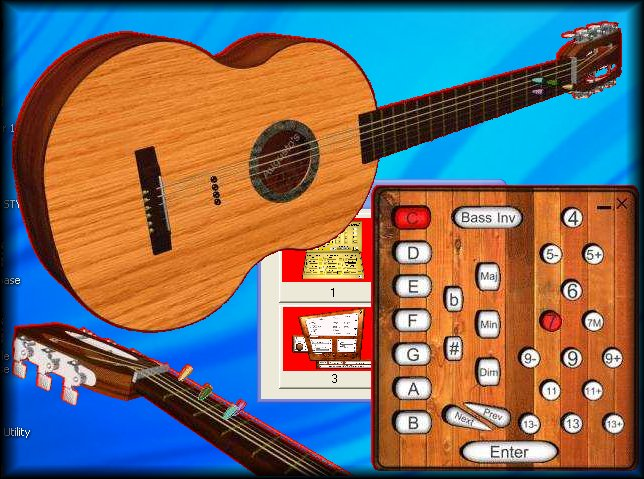



## Transparent Forms on Fly

### Description

This Project was based on program TRANSPARENT FORM MAKER by Robert Gainor.

I improved the method, saving the BytRegion array as binary file.
 
### More Info
 

             |
---                |---
**Submitted On**   |2004-08-23 05:51:42
**By**             |[Agustin Rodriguez](https://github.com/Planet-Source-Code/PSCIndex/blob/master/ByAuthor/agustin-rodriguez.md)
**Level**          |Intermediate
**User Rating**    |5.0 (10 globes from 2 users)
**Compatibility**  |VB 6\.0
**Category**       |[Graphics](https://github.com/Planet-Source-Code/PSCIndex/blob/master/ByCategory/graphics__1-46.md)
**World**          |[Visual Basic](https://github.com/Planet-Source-Code/PSCIndex/blob/master/ByWorld/visual-basic.md)
**Archive File**   |[Transparen1785228242004\.zip](https://github.com/Planet-Source-Code/agustin-rodriguez-transparent-forms-on-fly__1-55783/archive/master.zip)

